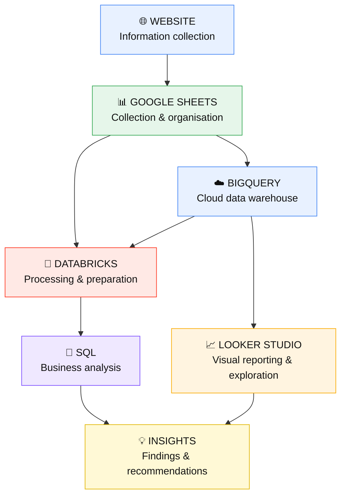

<div align="center">

# 🕊️ FarewellHub

### From information → to data → to insight → to better decisions

**An end-to-end data analytics project for a funeral services platform**

`Website` → `Google Sheets` → `BigQuery` → `Looker Studio` → `Databricks` → `SQL` → `Business Insights`

<br>


<br>


</div>

---

## 📑 Table of Contents

1. [Project Overview](#-project-overview)
2. [Business Objective](#-business-objective)
3. [End-to-End Data Flow](#-end-to-end-data-flow)
4. [Live Project Links](#-live-project-links)
5. [Stage-by-Stage Breakdown](#-stage-by-stage-breakdown)
6. [SQL Analysis](#-sql-analysis)
7. [From Data to Business Insights](#-from-data-to-business-insights)
8. [Project Screenshots](#-project-screenshots)
9. [Technology Stack](#-technology-stack)
10. [Repository Structure](#-repository-structure)
11. [What I Learned](#-what-i-learned)
12. [Future Improvements](#-future-improvements)
13. [About the Author](#-about-the-author)

---

## 📌 Project Overview

**FarewellHub** is a complete data analytics project built around a funeral services platform.

It shows the whole journey of data, not just the final dashboard:

> information is **captured** on a website, **organised** in Google Sheets, **loaded** into a cloud warehouse, **explored** visually, **cleaned and prepared** in Databricks, **analysed** with SQL, and finally turned into **business recommendations**.

| | |
|---|---|
| **Domain** | Funeral services |
| **Project type** | End-to-end data analytics (collection → insight) |
| **Core skills shown** | Data collection, quality checks, cleaning, SQL, dashboards, storytelling |
| **Goal** | Prove I can take a business from raw information to decisions |

---

## 🎯 Business Objective

Show how raw information becomes useful business intelligence by:

- 🌐 Collecting information from a website
- 📊 Organising it into a structured dataset
- ☁️ Loading the data into a cloud warehouse
- 📈 Connecting it to a visual reporting platform
- 🧱 Bringing it into Databricks for preparation and transformation
- 🧮 Using SQL to answer real business questions
- 💡 Turning analysis into clear, actionable insight

---

## 🔄 End-to-End Data Flow



**The guiding principle:**

```
Data  →  Finding  →  Meaning  →  Action
```

---

## 🔗 Live Project Links

| Stage | Link |
|---|---|
| 🎨 Website design (Figma) | [Open prototype](https://www.figma.com/make/sYnPIxBm1Ql967WDRmesjd/Funeral-Service-Hub?code-node-id=0-9&p=f&t=hKoiVl6iZFMhH9ly-0&fullscreen=1) |
| 📊 Dataset (Google Sheets) | [Open spreadsheet](https://docs.google.com/spreadsheets/d/16MxvoM3bt23Jw0mS1rV2pscQjTzJYCYj4i1E0j3H7sU/edit?gid=1309034753#gid=1309034753) |
| ☁️ Warehouse (BigQuery) | `farewellhub.FarewellHub.FarewellHub_leads` |
| 🧱 Notebook (Databricks) | [Open notebook](https://dbc-1f555e68-384c.cloud.databricks.com/editor/notebooks/3439460449319517?o=7474652278053184#command/8008453004454762) |

> 💡 Some of these links require sign-in. Screenshots of every stage are in the [Project Screenshots](#-project-screenshots) section.

---

## 🧭 Stage-by-Stage Breakdown

### 🌐 1. Website — where the data starts
Information is captured through the FarewellHub platform and prepared for the analytical workflow.

```
Website  →  Information captured  →  Structured records  →  Google Sheets
```

### 📊 2. Google Sheets — collection & organisation
Records were organised into clean rows and columns, giving the project a consistent, validated dataset before it entered the analytical environment.

```
Website information  →  Google Sheets  →  Structured dataset  →  Validation
```

### ☁️ 3. BigQuery — cloud warehouse
The dataset was loaded into BigQuery as the `FarewellHub_leads` table, making it queryable at scale and connectable to reporting tools.

### 📈 4. Looker Studio — visual reporting
An interactive dashboard gave a first visual read of the data **before** any deep SQL work:

- Charts and tables
- Filters and summary views
- Interactive exploration

### 🧱 5. Databricks — processing & preparation
Databricks became the analytical workspace where the data was inspected, prepared and queried.

```
Raw dataset → Inspection → Quality checks → Cleaning → Transformation → SQL analysis
```

### 🔍 6. Data Understanding
Before drawing any conclusion, the dataset was reviewed for:

- Available fields and data types
- Missing information
- Duplicate records
- Inconsistent values
- Relationships between fields
- Business dimensions and potential analytical questions

### 🧹 7. Data Preparation
```
Raw data → Check structure → Check missing values → Check duplicates
        → Check consistency → Clean / transform → Analysis-ready data
```
Every analysis runs on a **prepared** dataset, never on unchecked raw data.

---

## 🧮 SQL Analysis

Every query starts from a **business question**, not from code:

```
Business question → SQL query → Result → Interpretation → Business insight
```

### 🔎 Data overview
```sql
SELECT COUNT(*) AS total_records
FROM farewellhub_data;
```

### 🗂️ Category analysis
```sql
SELECT
    category,
    COUNT(*) AS total_records
FROM farewellhub_data
GROUP BY category
ORDER BY total_records DESC;
```

### 📍 Location analysis
```sql
SELECT
    location,
    COUNT(*) AS total_records
FROM farewellhub_data
GROUP BY location
ORDER BY total_records DESC;
```

### 📅 Trend analysis
```sql
SELECT
    date,
    COUNT(*) AS total_records
FROM farewellhub_data
GROUP BY date
ORDER BY date;
```

> 📝 Table and column names above are illustrative. The final queries in the repository use the actual fields in the FarewellHub dataset.

### 🧰 Two tools, one workflow

| Tool | Role |
|---|---|
| **Looker Studio** | Interactive visual exploration and dashboard reporting |
| **Databricks SQL** | Deeper querying, analysis and validation |

```
Data → Visual exploration → SQL analysis → Business questions → Insights
```

---

## 💡 From Data to Business Insights

For every important finding, I answer three questions:

| Question | Meaning |
|---|---|
| **What happened?** | What does the data show? |
| **Why does it matter?** | Why is this important to the business? |
| **What should happen next?** | What action should be considered? |

### 📌 Key analytical areas

| Area | Purpose |
|---|---|
| 🕊️ Service information | Understand available funeral-related services |
| 📍 Location | Understand geographical distribution |
| 🗂️ Categories | Compare service categories |
| 📅 Trends | Identify change over time |
| 📈 Records | Monitor volumes and activity |
| 👥 Customer information | Understand available customer-related data |
| 🎯 Business performance | Identify areas that need attention |

### 🧾 Findings
Detailed findings and recommendations are documented in [`6. Insights/Business Insights.md`](6.%20Insights/Business%20Insights.md).

<!--
Tip: add your top 3 findings here as a table to impress recruiters.

| # | Finding | Why it matters | Recommended action |
|---|---------|----------------|--------------------|
| 1 |         |                |                    |
-->

---

## 📸 Project Screenshots

<div align="center">

### 🌐 Website


### 📊 Google Sheets Dataset


### 📈 Looker Studio Dashboard


### 🧱 Databricks Analysis


</div>

---

## 🛠️ Technology Stack

| Tool | Purpose |
|---|---|
| 🌐 Website (Figma prototype) | Information collection |
| 📊 Google Sheets | Data collection and organisation |
| ☁️ BigQuery | Cloud data warehouse |
| 📈 Looker Studio (Google Data Studio) | Interactive visual reporting |
| 🧱 Databricks | Data processing and analysis |
| 🧮 SQL | Querying and business analysis |
| 🐙 GitHub | Documentation and portfolio |

---

## 📁 Repository Structure

```
FarewellHub/
│
├── README.md
│
├── 1. Website/
│   ├── Screenshots/
│   └── Website Documentation
│
├── 2. Data Collection/
│   └── Google Sheets/
│
├── 3. Data Visualisation/
│   ├── Data Studio/
│   └── Dashboard Screenshots/
│
├── 4. Data Processing/
│   ├── Data Quality Checks.sql
│   ├── Data Cleaning.sql
│   └── Data Transformation.sql
│
├── 5. SQL Analysis/
│   ├── Business Questions.sql
│   ├── Service Analysis.sql
│   ├── Customer Analysis.sql
│   └── Trend Analysis.sql
│
├── 6. Insights/
│   └── Business Insights.md
│
└── 7. Presentation/
    └── FarewellHub Presentation
```

---

## 🎓 What I Learned

This project taught me the **full analytics process**, not SQL alone.

**Technical skills**
`Data collection` · `Data organisation` · `Data quality checking` · `Data preparation` · `SQL` · `Databricks` · `BigQuery` · `Google Sheets` · `Looker Studio` · `Data visualisation` · `GitHub documentation`

**Analytical skills**
- Translating business needs into answerable questions
- Understanding a dataset before analysing it
- Identifying patterns and comparing categories
- Spotting trends over time
- Communicating findings clearly
- Turning findings into recommendations

### 🎯 The business analyst approach

Analytics isn't just writing code. The tools support the process, but the goal is to help people **make better decisions**.

```
BUSINESS PROBLEM → BUSINESS QUESTION → DATA → ANALYSIS
        → FINDING → INSIGHT → RECOMMENDATION → BUSINESS ACTION
```

---

## 🚀 Future Improvements

- [ ] Automated data collection and pipelines
- [ ] Automated dashboard refreshes
- [ ] Automated data-quality monitoring
- [ ] Additional business KPIs
- [ ] More advanced SQL analysis
- [ ] Customer segmentation
- [ ] Geographic analysis
- [ ] Predictive analytics
- [ ] Power BI reporting

---

## 👩‍💻 About the Author

**Alice**
Data Analyst · Business Analysis · SQL · Python · Excel · Power BI · Databricks

This project is part of my data analytics portfolio. It shows I can take a project from **data collection** through to **analysis, visualisation and business insight**.


---

<div align="center">

### 🕊️ FarewellHub

**From information → to data → to insight → to better decisions.**

⭐ If you found this project useful, consider giving it a star.

</div>
